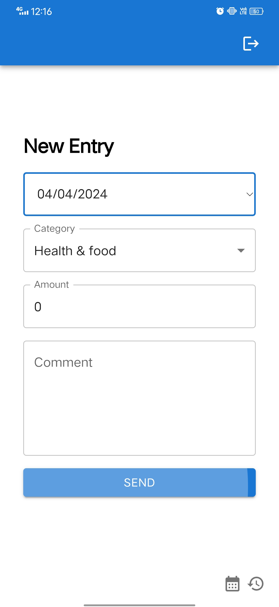

# Expensy


It is an expense manager that takes data from your personalized google spread sheet and loads into the Expensy application.

## Features

1. Add new expense.
2. Delete expense.
3. View Monthly expense
4. Visualize monthly expense using charts

## Getting started

**Prerequisites**

1. You need to have a google project created which has access to your google sheets api.
2. Spreadsheet Schema. Refer [this](./docs/spreadsheet-schema.md).

### Setup environment variables

1. create and environment file and store following environment variables related to google project.

```
export CASHFLOW_CLIENT_ID="<google project client id>"
export CASHFLOW_PRIVATE_KEY_ID="<google project private key id>"
export CASHFLOW_PRIVATE_KEY="<google project private key>"
export CASHFLOW_CLIENT_EMAIL="<service account email for the sheet>"
```

> [!NOTE] > `CASHFLOW_CLIENT_EMAIL` is something you will get from google project dashboard. This email you need to provide access in expenses spreadsheet.

2. Write environment variables related to application.

```
export SPREADSHEET_ID="<spreadsheet id>"
export SHEET_ID="<expense sheet id>"
export USERNAME="<login username>"
export PASSWORD="<login password>"
export SESSION_SECRET="<secret for session>"
export REDIS_URL="<redis url>"
```

Refer [this](./docs/environment-variables.md) doc to understand these environment variables.

### Create credential file for Google client

`Expensy` requires you to create `root_project/secrets/cred.json` credential file which will be consumed by Google client internally used by the application.

Following shows steps to create the `cred.json` file.

1. Export environment variables in the shell.

```
source .env
```

2. Populate credentials file.

```
./bin/setupSecret.sh
```

> [!NOTE]
> Please give execution permission to it if required. (use` chmod +x ./bin/setupSecret.sh`)

3. Verify if the content in `./secrets/cred.json` is populated with correct information by referring your `.env` file.

### Build UI

Run the following script to build UI.

```
./bin/build.sh
```

It should do all the things.

You are good to go.

### Run application

1. Run `npm run dev`.
2. Open browser and hit `localhost:3000`
3. Enter your username and password that you specified as environment variable.
4. You shall screen to create new expense entry.
